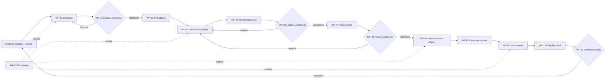
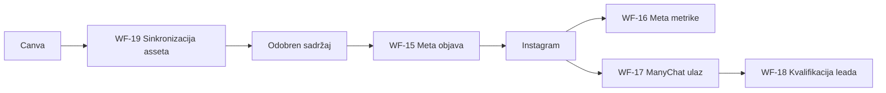

# AID n8n workflow registry

Ovaj direktorij čuva implementacijske specifikacije workflowa. Datoteke nisu n8n import JSON i ne predstavljaju aktivnu automatizaciju. Svaki workflow mora prvo biti implementiran, konfiguriran u n8n-u, testiran i odobren.

## Statusi

- `specified` — dokumentiran, ali nije implementiran;
- `planned-later` — izvan MVP-a i ovisi o vanjskoj integraciji;
- `blocked-integration` — ne aktivirati bez službenih API vjerodajnica i testnog okruženja.

## Pregled sustava

## Kasnije integracije

## Struktura

- `specs/` — jedna specifikacija i Mermaid vizual za svaki glavni i zajednički workflow;
- glavni workflowi: `WF-01` do `WF-19`;
- zajednički podworkflowi: `SUB-01` do `SUB-09`.

Službena sadržajna pravila nalaze se u `docs/business_rules.md`, model podataka u `docs/database_schema.md`, a širi opis workflowa u `docs/n8n_workflows.md`.

