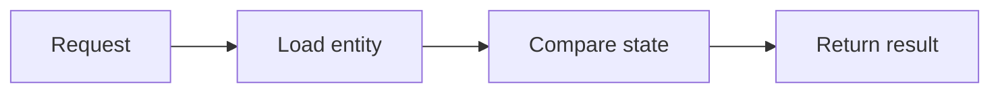

# SUB-01 — validate entity state

- Vrsta: zajednički n8n podworkflow
- Status: `specified`
- Svrha: Validate status, ownership and current version before a state transition
- Ulazi: Entity ID, expected status and expected version
- Izlaz: Validated entity or explicit business block

## Vizual

## Ugovor

Pozivatelj mora proslijediti `workflow_run_id` i `correlation_id` kada već postoje. Podworkflow ne smije sakriti poslovnu blokadu, upisati tajnu u log niti samostalno promijeniti odobrenje sadržaja.

