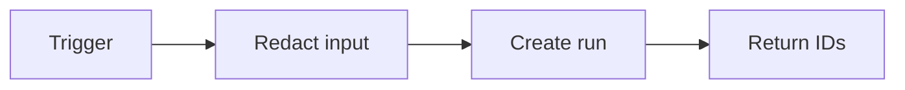

# SUB-02 — start workflow run

- Vrsta: zajednički n8n podworkflow
- Status: `specified`
- Svrha: Create the standard execution record and correlation ID
- Ulazi: Workflow name, trigger, entity reference and safe input summary
- Izlaz: workflow_run_id and correlation_id

## Vizual

## Ugovor

Pozivatelj mora proslijediti `workflow_run_id` i `correlation_id` kada već postoje. Podworkflow ne smije sakriti poslovnu blokadu, upisati tajnu u log niti samostalno promijeniti odobrenje sadržaja.

