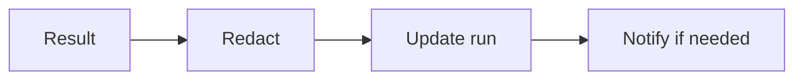

# SUB-03 — finish workflow run

- Vrsta: zajednički n8n podworkflow
- Status: `specified`
- Svrha: Close an execution consistently
- Ulazi: workflow_run_id, final status, safe output or error
- Izlaz: Completed workflow run and optional alert event

## Vizual

## Ugovor

Pozivatelj mora proslijediti `workflow_run_id` i `correlation_id` kada već postoje. Podworkflow ne smije sakriti poslovnu blokadu, upisati tajnu u log niti samostalno promijeniti odobrenje sadržaja.

