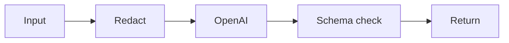

# SUB-04 — openai structured call

- Vrsta: zajednički n8n podworkflow
- Status: `specified`
- Svrha: Call OpenAI with schema validation and safe logging
- Ulazi: Prompt version, approved context, JSON schema and timeout
- Izlaz: Validated structured response or controlled failure

## Vizual

## Ugovor

Pozivatelj mora proslijediti `workflow_run_id` i `correlation_id` kada već postoje. Podworkflow ne smije sakriti poslovnu blokadu, upisati tajnu u log niti samostalno promijeniti odobrenje sadržaja.

