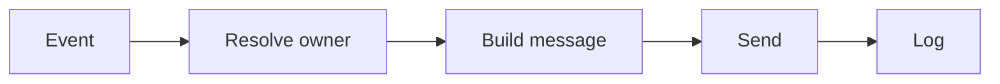

# SUB-05 — notify human

- Vrsta: zajednički n8n podworkflow
- Status: `specified`
- Svrha: Send an actionable notification without secrets
- Ulazi: Recipient role, entity, reason and recommended action
- Izlaz: Delivery result linked to workflow run

## Vizual

## Ugovor

Pozivatelj mora proslijediti `workflow_run_id` i `correlation_id` kada već postoje. Podworkflow ne smije sakriti poslovnu blokadu, upisati tajnu u log niti samostalno promijeniti odobrenje sadržaja.

