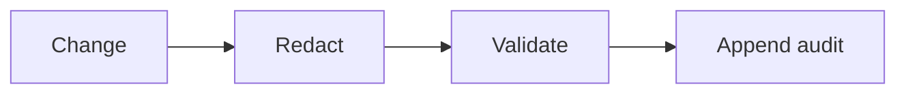

# SUB-06 — write audit event

- Vrsta: zajednički n8n podworkflow
- Status: `specified`
- Svrha: Append an immutable audit event
- Ulazi: Actor, action, entity, previous state, new state and correlation ID
- Izlaz: Append-only audit record

## Vizual

## Ugovor

Pozivatelj mora proslijediti `workflow_run_id` i `correlation_id` kada već postoje. Podworkflow ne smije sakriti poslovnu blokadu, upisati tajnu u log niti samostalno promijeniti odobrenje sadržaja.

