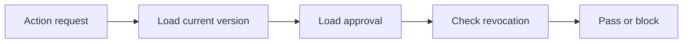

# SUB-07 — verify approval gate

- Vrsta: zajednički n8n podworkflow
- Status: `specified`
- Svrha: Verify approval for the exact current version
- Ulazi: Entity, content_version_id and intended action
- Izlaz: Pass or explicit approval block

## Vizual

## Ugovor

Pozivatelj mora proslijediti `workflow_run_id` i `correlation_id` kada već postoje. Podworkflow ne smije sakriti poslovnu blokadu, upisati tajnu u log niti samostalno promijeniti odobrenje sadržaja.

