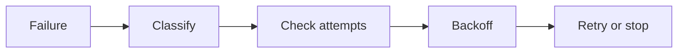

# SUB-08 — safe retry

- Vrsta: zajednički n8n podworkflow
- Status: `specified`
- Svrha: Retry only transient technical failures
- Ulazi: Error class, attempt number and idempotency key
- Izlaz: Delayed retry or final failure

## Vizual

## Ugovor

Pozivatelj mora proslijediti `workflow_run_id` i `correlation_id` kada već postoje. Podworkflow ne smije sakriti poslovnu blokadu, upisati tajnu u log niti samostalno promijeniti odobrenje sadržaja.

