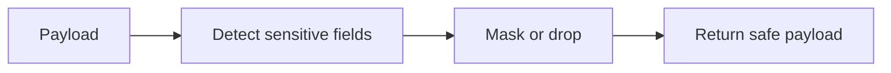

# SUB-09 — redact secrets

- Vrsta: zajednički n8n podworkflow
- Status: `specified`
- Svrha: Remove tokens, credentials and unnecessary personal data before logging
- Ulazi: Arbitrary workflow payload
- Izlaz: Sanitized payload

## Vizual

## Ugovor

Pozivatelj mora proslijediti `workflow_run_id` i `correlation_id` kada već postoje. Podworkflow ne smije sakriti poslovnu blokadu, upisati tajnu u log niti samostalno promijeniti odobrenje sadržaja.

