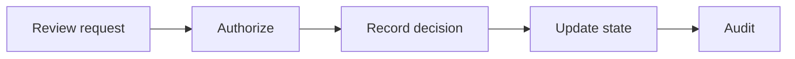

# WF-02 — strategy approval

- Faza: `MVP`
- Status: `specified`
- Okidač: Authenticated approval action
- Ulazi: Exact strategy_version_id, decision, reviewer
- Obavezna kontrola: Reviewer is authorized and version is current
- Izlaz: Approval record and updated strategy status
- Sigurno ponašanje: Stale version or unauthorized reviewer blocks the run

## Vizual

## Implementacijska napomena

Svako izvršenje mora otvoriti i zatvoriti `workflow_runs` zapis, koristiti korelacijski ID i zapisati audit događaj za promjenu poslovnog stanja. Tehnički retry mora biti ograničen i idempotentan; poslovna blokada zahtijeva ljudsku odluku.

