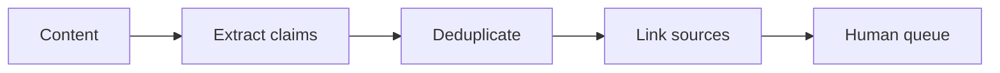

# WF-05 — claim extraction

- Faza: `MVP`
- Status: `specified`
- Okidač: New content version
- Ulazi: Caption or script and linked sources
- Obavezna kontrola: Content version is current
- Izlaz: Deduplicated claims in pending state
- Sigurno ponašanje: No claim may be silently marked verified

## Vizual

## Implementacijska napomena

Svako izvršenje mora otvoriti i zatvoriti `workflow_runs` zapis, koristiti korelacijski ID i zapisati audit događaj za promjenu poslovnog stanja. Tehnički retry mora biti ograničen i idempotentan; poslovna blokada zahtijeva ljudsku odluku.

