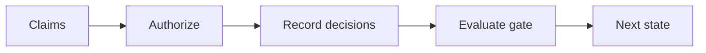

# WF-06 — human claim verification

- Faza: `MVP`
- Status: `specified`
- Okidač: Authenticated verifier action
- Ulazi: Claim decisions, sources, verifier notes
- Obavezna kontrola: Verifier is authorized and every required claim is resolved
- Izlaz: verified or changes_requested content state
- Sigurno ponašanje: Pending or rejected claim blocks approval

## Vizual

## Implementacijska napomena

Svako izvršenje mora otvoriti i zatvoriti `workflow_runs` zapis, koristiti korelacijski ID i zapisati audit događaj za promjenu poslovnog stanja. Tehnički retry mora biti ograničen i idempotentan; poslovna blokada zahtijeva ljudsku odluku.

