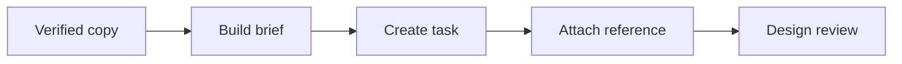

# WF-07 — canva package

- Faza: `MVP`
- Status: `specified`
- Okidač: Verified content version
- Ulazi: Verified copy, visual brief, brand rules
- Obavezna kontrola: All blocking claims are resolved
- Izlaz: Structured Canva production package
- Sigurno ponašanje: Content changes invalidate the package

## Vizual

## Implementacijska napomena

Svako izvršenje mora otvoriti i zatvoriti `workflow_runs` zapis, koristiti korelacijski ID i zapisati audit događaj za promjenu poslovnog stanja. Tehnički retry mora biti ograničen i idempotentan; poslovna blokada zahtijeva ljudsku odluku.

