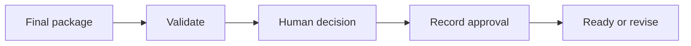

# WF-08 — final content approval

- Faza: `MVP`
- Status: `specified`
- Okidač: Authenticated editor decision
- Ulazi: Exact content_version_id, final assets, sources, schedule
- Obavezna kontrola: Copy, assets and claims belong to the same version
- Izlaz: Approval decision and audit event
- Sigurno ponašanje: Any later material edit revokes approval

## Vizual

## Implementacijska napomena

Svako izvršenje mora otvoriti i zatvoriti `workflow_runs` zapis, koristiti korelacijski ID i zapisati audit događaj za promjenu poslovnog stanja. Tehnički retry mora biti ograničen i idempotentan; poslovna blokada zahtijeva ljudsku odluku.

