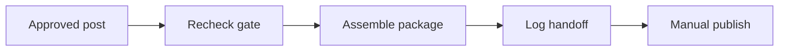

# WF-09 — manual publish package

- Faza: `MVP`
- Status: `specified`
- Okidač: Approved time reached or manual request
- Ulazi: Approved version and final media
- Obavezna kontrola: Approval remains valid immediately before packaging
- Izlaz: Exact caption, media and checklist
- Sigurno ponašanje: Revoked approval or wrong version blocks output

## Vizual

## Implementacijska napomena

Svako izvršenje mora otvoriti i zatvoriti `workflow_runs` zapis, koristiti korelacijski ID i zapisati audit događaj za promjenu poslovnog stanja. Tehnički retry mora biti ograničen i idempotentan; poslovna blokada zahtijeva ljudsku odluku.

