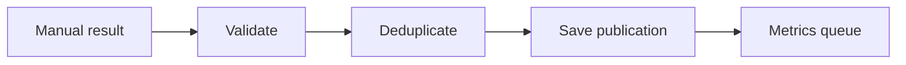

# WF-10 — record manual publication

- Faza: `MVP`
- Status: `specified`
- Okidač: User records published Instagram post
- Ulazi: Instagram post ID or URL, time, approved version
- Obavezna kontrola: External post is unique and maps to approved content
- Izlaz: Publication record in published state
- Sigurno ponašanje: Duplicate or unapproved mapping is rejected

## Vizual

## Implementacijska napomena

Svako izvršenje mora otvoriti i zatvoriti `workflow_runs` zapis, koristiti korelacijski ID i zapisati audit događaj za promjenu poslovnog stanja. Tehnički retry mora biti ograničen i idempotentan; poslovna blokada zahtijeva ljudsku odluku.

