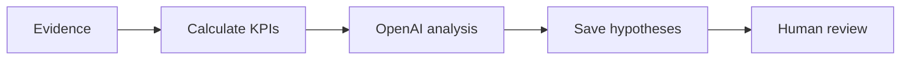

# WF-12 — results analysis

- Faza: `MVP`
- Status: `specified`
- Okidač: Metric snapshot or month close
- Ulazi: Strategy, content hypothesis, metrics, qualitative signals
- Obavezna kontrola: Evidence set is linked and complete enough
- Izlaz: Draft content insights for human review
- Sigurno ponašanje: AI output cannot directly change strategy

## Vizual

## Implementacijska napomena

Svako izvršenje mora otvoriti i zatvoriti `workflow_runs` zapis, koristiti korelacijski ID i zapisati audit događaj za promjenu poslovnog stanja. Tehnički retry mora biti ograničen i idempotentan; poslovna blokada zahtijeva ljudsku odluku.

