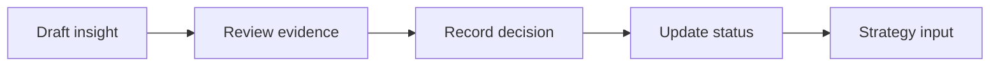

# WF-13 — insight approval

- Faza: `MVP`
- Status: `specified`
- Okidač: Strategist decision
- Ulazi: Exact insight ID, evidence, decision
- Obavezna kontrola: Reviewer is authorized
- Izlaz: Approved or rejected insight
- Sigurno ponašanje: Unapproved insight cannot feed next strategy

## Vizual

## Implementacijska napomena

Svako izvršenje mora otvoriti i zatvoriti `workflow_runs` zapis, koristiti korelacijski ID i zapisati audit događaj za promjenu poslovnog stanja. Tehnički retry mora biti ograničen i idempotentan; poslovna blokada zahtijeva ljudsku odluku.

