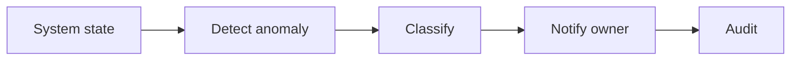

# WF-14 — operations monitoring

- Faza: `MVP`
- Status: `specified`
- Okidač: Schedule or workflow failure event
- Ulazi: Workflow runs and entity states
- Obavezna kontrola: Alert rules and age thresholds are configured
- Izlaz: Actionable alert with run_id and owner
- Sigurno ponašanje: Monitoring never changes business approval state

## Vizual

## Implementacijska napomena

Svako izvršenje mora otvoriti i zatvoriti `workflow_runs` zapis, koristiti korelacijski ID i zapisati audit događaj za promjenu poslovnog stanja. Tehnički retry mora biti ograničen i idempotentan; poslovna blokada zahtijeva ljudsku odluku.

