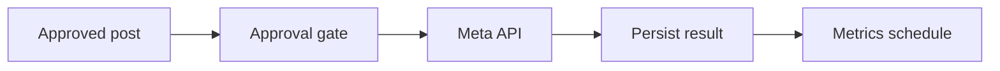

# WF-15 — meta publishing

- Faza: `Later`
- Status: `blocked-integration`
- Okidač: Approved scheduled publication
- Ulazi: Valid approval, final asset, Meta credentials
- Obavezna kontrola: Recheck approval, version, schedule and idempotency key
- Izlaz: Instagram publication ID and permalink
- Sigurno ponašanje: Never use Instagram password; API failure cannot generate replacement copy

## Vizual

## Implementacijska napomena

Svako izvršenje mora otvoriti i zatvoriti `workflow_runs` zapis, koristiti korelacijski ID i zapisati audit događaj za promjenu poslovnog stanja. Tehnički retry mora biti ograničen i idempotentan; poslovna blokada zahtijeva ljudsku odluku.

