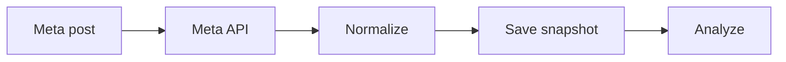

# WF-16 — meta metrics

- Faza: `Later`
- Status: `blocked-integration`
- Okidač: Scheduled capture window
- Ulazi: Published Meta media ID and API credentials
- Obavezna kontrola: Requested metrics are permitted and publication is known
- Izlaz: Normalized and raw metric snapshot
- Sigurno ponašanje: Permission loss alerts human operator

## Vizual

## Implementacijska napomena

Svako izvršenje mora otvoriti i zatvoriti `workflow_runs` zapis, koristiti korelacijski ID i zapisati audit događaj za promjenu poslovnog stanja. Tehnički retry mora biti ograničen i idempotentan; poslovna blokada zahtijeva ljudsku odluku.

