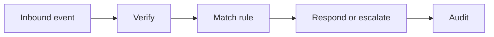

# WF-17 — manychat inbound

- Faza: `Later`
- Status: `blocked-integration`
- Okidač: Verified comment or DM webhook
- Ulazi: Approved automation rule and inbound event
- Obavezna kontrola: Signature, consent rules and allowed intent pass
- Izlaz: Recorded interaction or human escalation
- Sigurno ponašanje: Unknown intent cannot receive unrestricted AI response

## Vizual

## Implementacijska napomena

Svako izvršenje mora otvoriti i zatvoriti `workflow_runs` zapis, koristiti korelacijski ID i zapisati audit događaj za promjenu poslovnog stanja. Tehnički retry mora biti ograničen i idempotentan; poslovna blokada zahtijeva ljudsku odluku.

