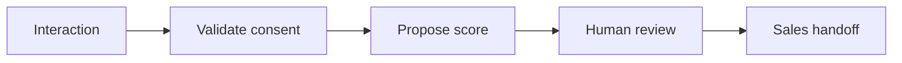

# WF-18 — lead qualification

- Faza: `Later`
- Status: `planned-later`
- Okidač: Eligible interaction
- Ulazi: Minimum contact and business relevance signals
- Obavezna kontrola: Consent and data minimization rules pass
- Izlaz: Reviewable lead score and handoff
- Sigurno ponašanje: Automated score is not a final business decision

## Vizual

## Implementacijska napomena

Svako izvršenje mora otvoriti i zatvoriti `workflow_runs` zapis, koristiti korelacijski ID i zapisati audit događaj za promjenu poslovnog stanja. Tehnički retry mora biti ograničen i idempotentan; poslovna blokada zahtijeva ljudsku odluku.

