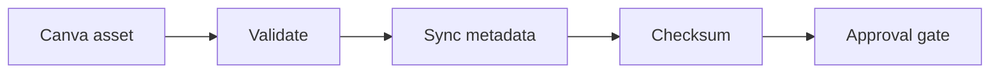

# WF-19 — canva asset sync

- Faza: `Later`
- Status: `blocked-integration`
- Okidač: Approved Canva export event or manual request
- Ulazi: Canva design reference and content version
- Obavezna kontrola: Provider capability, version and checksum are valid
- Izlaz: Versioned media asset reference
- Sigurno ponašanje: New asset never replaces approved asset silently

## Vizual

## Implementacijska napomena

Svako izvršenje mora otvoriti i zatvoriti `workflow_runs` zapis, koristiti korelacijski ID i zapisati audit događaj za promjenu poslovnog stanja. Tehnički retry mora biti ograničen i idempotentan; poslovna blokada zahtijeva ljudsku odluku.

